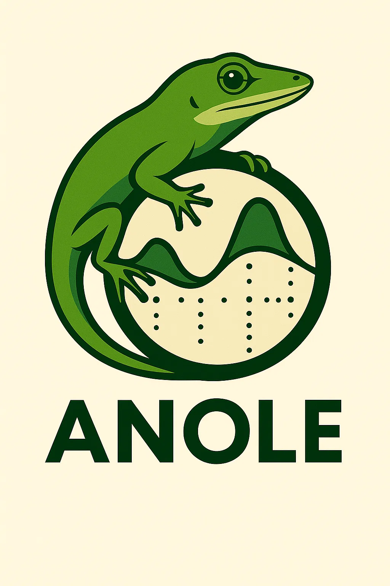

# ANOLE — Adaptive Navigation for Open‑ended Ligand Exploration

ANOLE is an agentic workflow that enumerates, characterizes, and optimizes small molecules toward user‑defined target properties. It wires together nodes (argument extraction, enumeration, Bayesian optimization, characterization, summarization) with clear telemetry and checkpoints.



## Features

- Prompt-driven optimization over a molecular search space
- Enumeration + RDKit/predictive model characterization + Bayesian optimization
- Checkpoints and resumability
- Clean summary with best molecules and baseline vs. optimized comparison

## Requirements

- Python 3.12
- RDKit (installed via conda/micromamba in Docker image)
- External dependency: healer (moelcule enumerator)

Note: Files in `legacy/` are old and not used by the current workflow. They remain for reference but are excluded from the Docker build context.

## Quick start (Docker)

Build the image and run with the example prompt. The image bundles Python 3.12, RDKit, and pip dependencies.

```bash
docker build -t anole:latest .

# Run the example prompt
docker run --rm anole:latest

# Provide your own prompt
docker run --rm anole:latest run "Optimize aspirin for better QED. Enumerate 50 analogs and run 3 iterations."

# Resume from a checkpoint mounted from the host
docker run --rm -v "$PWD/checkpoints:/app/checkpoints" anole:latest resume /app/checkpoints/<checkpoint_file>.pkl

# Export results to a mounted path
docker run --rm -v "$PWD:/app" anole:latest export --output /app/results.json "Optimize caffeine for higher logP and lower TPSA"
```

### Mounting configuration and API keys

Copy `config.example.yml` to `config.yml` and edit as needed (e.g., credentials for external services). Mount it into the container:

```bash
cp config.example.yml config.yml
docker run --rm -v "$PWD/config.yml:/app/config.yml" anole:latest run "Your prompt here"
```

### Checkpoints and artifacts

- Checkpoints are written to `checkpoints/` (mount this directory to persist across runs).
- Final results are exportable via `--output` flag.

## Local development

You can run ANOLE locally if you have Python 3.12 and RDKit available.

```bash
# Optional: use conda/mamba to install rdkit, then pip install the rest
conda create -n anole python=3.12 -c conda-forge rdkit
conda activate anole
pip install -r requirements.txt

# Run
python run_workflow.py --example
```

## Extending the agent and workflow

The codebase is organized into clear modules so you can swap or add nodes/tools without changing the whole system.

- `edges/graph_builder.py`: builds the LangGraph state graph and wires node transitions
- `nodes/`: individual workflow nodes (e.g., `extract_arguments.py`, `enumerate_molecules.py`, `bo_iteration.py`, `characterize_molecules.py`, `check_exit_conditions.py`, `summarize_results.py`)
- `tools/`: pluggable tools used by nodes (e.g., `enumerator_tool.py`, `molecule_characterization_tool.py`, `bayesopt_tool.py`, `stoplight_tool.py`)
- `schemas/`: Pydantic models for state, characterization schemas, error types
- `run_workflow.py`: runner with checkpointing and exporting

Common extension points:

- Add a new property or tool: extend `schemas/characterization.py` mappings and implement a tool under `tools/`; wire it in `nodes/characterize_molecules.py`.
- Change selection strategy: update `nodes/bo_iteration.py` or the optimizer tool.
- New inputs or parsing rules: modify `nodes/extract_arguments.py`.

Tip: emit structured telemetry for new nodes/tools so failures are actionable.

## Configuration

Use `config.yml` to store credentials and options. See `config.example.yml` for the shape. At runtime the workflow will prefer `config.yml` if present.

## License

See `LICENSE`.
