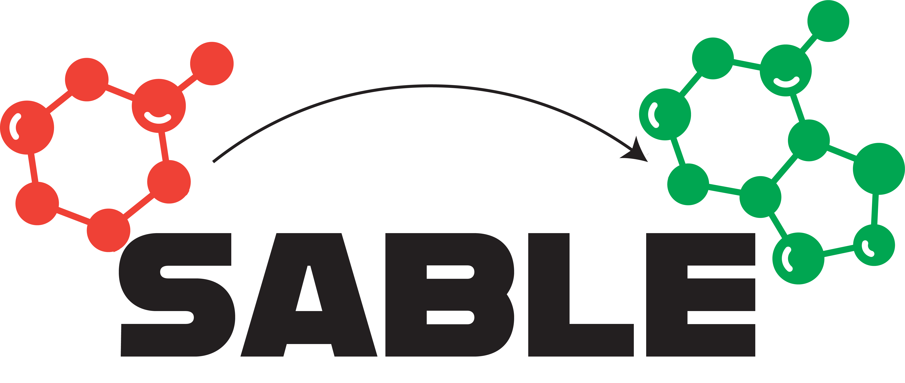

# SABLE

**Synthetically-accessible Agentic Bayesian Ligand Exploration**

SABLE is an agentic molecular optimization platform. It converts natural-language objectives into iterative workflows that enumerate compounds, evaluate molecular properties, apply Bayesian optimization, and report promising candidates.

<p align="center">
  
</p>

## Features

- Natural-language molecular optimization objectives
- Compound enumeration and RDKit-based characterization
- Single- and multi-objective Bayesian optimization
- Persistent runs, checkpoints, and audit records
- FastAPI backend, React frontend, and asynchronous Celery workers
- Optional OpenAI or Google Gemini argument extraction

## Requirements

The recommended setup requires:

- Docker with Docker Compose
- An OpenAI or Google Gemini API key for LLM-assisted extraction (optional)

For local CLI development, use Python 3.12 and an environment that provides RDKit.

## Quick Start

1. Create a local environment file:

   ```bash
   cp .env.example .env
   ```

2. Set secure values for `POSTGRES_PASSWORD` and `SECRET_KEY` in `.env`. Add an LLM provider and API key if needed:

   ```dotenv
   LLM_PROVIDER=gemini
   GOOGLE_API_KEY=your_api_key
   ```

   OpenAI is also supported with `LLM_PROVIDER=openai` and `OPENAI_API_KEY`.

3. Start the development stack:

   ```bash
   docker compose --profile dev up --build api celery_worker ui
   ```

4. Open the application:

   - Web interface: http://localhost:5173
   - API: http://localhost:8000
   - API documentation: http://localhost:8000/docs

PostgreSQL, Redis, and database migrations start automatically as dependencies of the stack. Stop all services with `docker compose --profile dev down`.

## Command-Line Workflow

Build the image and run an optimization directly:

```bash
docker build -t sable:latest .
docker run --rm sable:latest run "Optimize aspirin for better QED. Enumerate 50 analogs and run 3 iterations."
```

Persist checkpoints and results by mounting local directories as needed:

The workflow creates `checkpoints/` automatically on its first run.

```bash
docker run --rm \
  -v "$PWD/checkpoints:/app/checkpoints" \
  -v "$PWD/data:/app/data" \
  sable:latest run "Optimize caffeine for higher QED"
```

Resume a saved checkpoint:

```bash
docker run --rm \
  -v "$PWD/checkpoints:/app/checkpoints" \
  sable:latest resume /app/checkpoints/<checkpoint>.pkl
```

## Local Development

Create an environment with Python 3.12 and RDKit, then install the Python dependencies:

```bash
conda create -n sable -c conda-forge python=3.12 rdkit
conda activate sable
pip install -r requirements.txt
python run_workflow.py --example
```

Run a custom objective or resume a checkpoint:

```bash
python run_workflow.py "Optimize ibuprofen for lower TPSA" --output results.json
python run_workflow.py --checkpoint checkpoints/<checkpoint>.pkl
```

Run the test suite with:

```bash
pytest
```

## Configuration

Configuration is loaded from environment variables. Copy `.env.example` to `.env` for the complete list.

| Variable | Purpose |
| --- | --- |
| `LLM_PROVIDER` | Argument extraction provider: `openai` or `gemini` |
| `OPENAI_API_KEY` | OpenAI credentials |
| `GOOGLE_API_KEY` | Google Gemini credentials |
| `POSTGRES_PASSWORD` | PostgreSQL password used by Docker Compose |
| `REDIS_PASSWORD` | Redis password used by Docker Compose |
| `SECRET_KEY` | Application signing key |
| `MOLECULAR_FP` | Molecular fingerprint or descriptor strategy |
| `MULTI_OPT_TYPE` | Multi-objective optimization strategy |
| `SABLE_DATA_ROOT` | Root directory for run artifacts |
| `BOLTZ_BASE_URL` | Base URL of a user-managed Boltz2 API deployment |
| `BOLTZ_API_TOKEN` | Authentication token for the Boltz2 API |

The workflow can fall back to rule-based argument extraction when no LLM is configured. Protein structure prediction and HPC execution require the additional Boltz and HPC variables documented in `.env.example`.

### Boltz2 Binding Affinity

Binding-affinity runs require a separate [Boltz2 API](https://github.com/eneskelestemur/boltz2-api) deployment. Deploy and operate that service on your own NVIDIA GPU machine by following the instructions in its repository, then add the resulting API endpoint and token to your `.env` file:

```dotenv
BOLTZ_BASE_URL=https://your-boltz2-api.example.com
BOLTZ_API_TOKEN=your_api_token
```

SABLE does not deploy or host the Boltz2 service. The configured endpoint must be reachable from the SABLE API and Celery worker containers.

## Project Structure

| Path | Description |
| --- | --- |
| `nodes/` | LangGraph workflow steps |
| `edges/` | Workflow graph construction |
| `tools/` | Enumeration, characterization, and optimization tools |
| `schemas/` | Workflow state and validation models |
| `server/` | FastAPI application and background tasks |
| `ui/` | React and Vite web interface |
| `config/` | Property and tool definitions |
| `migrations/` | Alembic database migrations |
| `run_workflow.py` | Standalone workflow runner |

To extend the optimization pipeline, add or update a tool in `tools/`, connect it through the relevant node in `nodes/`, and register configurable behavior in `config/tools.yml` or `config/properties.yml`.

## Production

Build and start the production API, worker, and Nginx frontend with:

```bash
docker compose --profile prod up --build api celery_worker frontend
```

The frontend is served at http://localhost:8080. Review all secrets, authentication, storage, CORS, and infrastructure settings in `.env` before deploying outside a local environment.

## Citation

If SABLE supports your research, please cite our [paper](https://arxiv.org/abs/2608.11483):

```bibtex
@misc{idanwekhai2026modularagenticframeworksynthetically,
   title={A Modular Agentic Framework for Synthetically Constrained Multi-Objective Hit-to-Lead Optimization},
   author={Kelvin P. Idanwekhai and Enes Kelestemur and Benjamin Strickland and Matthew Hart and Steini Davidsson and Angelos Angelopoulos and Ron Alterovitz and Marcello DeLuca and Alexander Tropsha},
   year={2026},
   eprint={2608.11483},
   archivePrefix={arXiv},
   primaryClass={cs.AI},
   url={https://arxiv.org/abs/2608.11483},
}
```

## License

This project is licensed under the terms in [LICENSE](LICENSE).