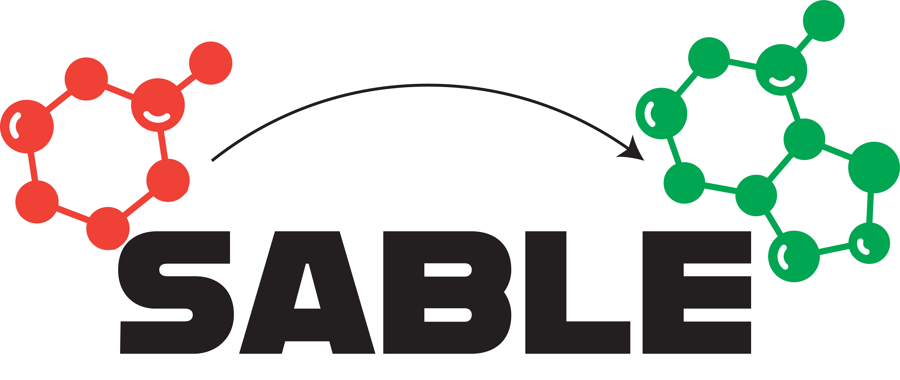

# SABLE

**Synthetically-accessible Agentic Bayesian Ligand Exploration**

SABLE is an agentic molecular optimization platform. It converts natural-language objectives into iterative workflows that enumerate compounds, evaluate molecular properties, apply Bayesian optimization, and report promising candidates.

<p align="center">
  
</p>

## Features

- Natural-language molecular optimization objectives
- Compound enumeration and RDKit-based characterization
- Single- and multi-objective Bayesian optimization
- Persistent runs, checkpoints, and audit records
- FastAPI backend, React frontend, and asynchronous Celery workers
- Optional OpenAI or Google Gemini argument extraction

## Requirements

The recommended setup requires:

- Docker with Docker Compose
- An OpenAI or Google Gemini API key for LLM-assisted extraction (optional)

For local CLI development, use Python 3.12 and an environment that provides RDKit.

## Quick Start

1. Create a local environment file:

   ```bash
   cp .env.example .env
   ```

2. Set secure values for `POSTGRES_PASSWORD` and `SECRET_KEY` in `.env`. Add an LLM provider and API key if needed:

   ```dotenv
   LLM_PROVIDER=gemini
   GOOGLE_API_KEY=your_api_key
   ```

   OpenAI is also supported with `LLM_PROVIDER=openai` and `OPENAI_API_KEY`.

3. Start the development stack:

   ```bash
   docker compose --profile dev up --build api celery_worker ui
   ```

4. Open the application:

   - Web interface: http://localhost:5173
   - API: http://localhost:8000
   - API documentation: http://localhost:8000/docs

PostgreSQL, Redis, and database migrations start automatically as dependencies of the stack. Stop all services with `docker compose --profile dev down`.

## Command-Line Workflow

Build the image and run an optimization directly:

```bash
docker build -t sable:latest .
docker run --rm sable:latest run "Optimize aspirin for better QED. Enumerate 50 analogs and run 3 iterations."
```

Persist checkpoints and results by mounting local directories as needed:

The workflow creates `checkpoints/` automatically on its first run.

```bash
docker run --rm \
  -v "$PWD/checkpoints:/app/checkpoints" \
  -v "$PWD/data:/app/data" \
  sable:latest run "Optimize caffeine for higher QED"
```

Resume a saved checkpoint:

```bash
docker run --rm \
  -v "$PWD/checkpoints:/app/checkpoints" \
  sable:latest resume /app/checkpoints/<checkpoint>.pkl
```

## Local Development

Create an environment with Python 3.12 and RDKit, then install the Python dependencies:

```bash
conda create -n sable -c conda-forge python=3.12 rdkit
conda activate sable
pip install -r requirements.txt
python run_workflow.py --example
```

Run a custom objective or resume a checkpoint:

```bash
python run_workflow.py "Optimize ibuprofen for lower TPSA" --output results.json
python run_workflow.py --checkpoint checkpoints/<checkpoint>.pkl
```

Run the test suite with:

```bash
pytest
```

## Configuration

Configuration is loaded from environment variables. Copy `.env.example` to `.env` for the complete list.

| Variable | Purpose |
| --- | --- |
| `LLM_PROVIDER` | Argument extraction provider: `openai` or `gemini` |
| `OPENAI_API_KEY` | OpenAI credentials |
| `GOOGLE_API_KEY` | Google Gemini credentials |
| `POSTGRES_PASSWORD` | PostgreSQL password used by Docker Compose |
| `REDIS_PASSWORD` | Redis password used by Docker Compose |
| `SECRET_KEY` | Application signing key |
| `MOLECULAR_FP` | Molecular fingerprint or descriptor strategy |
| `MULTI_OPT_TYPE` | Multi-objective optimization strategy |
| `SABLE_DATA_ROOT` | Root directory for run artifacts |
| `SABLE_STORAGE_BACKEND` | Run storage backend: `local` or `azure` |
| `AZURE_STORAGE_ACCOUNT_URL` | Azure Blob service URL used with managed identity |
| `AZURE_STORAGE_CONTAINER` | Azure Blob container for durable run data |
| `BOLTZ_BASE_URL` | Base URL of a user-managed Boltz2 API deployment |
| `BOLTZ_API_TOKEN` | Authentication token for the Boltz2 API |

The workflow can fall back to rule-based argument extraction when no LLM is configured. Protein structure prediction and HPC execution require the additional Boltz and HPC variables documented in `.env.example`.

### Boltz2 Binding Affinity

Binding-affinity runs require a separate [Boltz2 API](https://github.com/eneskelestemur/boltz2-api) deployment. Deploy and operate that service on your own NVIDIA GPU machine by following the instructions in its repository, then add the resulting API endpoint and token to your `.env` file:

```dotenv
BOLTZ_BASE_URL=https://your-boltz2-api.example.com
BOLTZ_API_TOKEN=your_api_token
```

SABLE does not deploy or host the Boltz2 service. The configured endpoint must be reachable from the SABLE API and Celery worker containers.

### OpenFE Binding Free Energy

The `openfe` characterizer calls a separately hosted OpenFE campaign API. No local
OpenFE, OpenMM, or GPU installation is needed in SABLE. Configure the endpoint in
`.env`, then recreate the API and worker containers to load changed environment values:

```dotenv
OPENFE_BASE_URL=http://your-openfe-host:8000
OPENFE_API_TOKEN=
OPENFE_POLL_INTERVAL=10
OPENFE_WAIT_TIMEOUT=3600
```

The token is optional and is sent as a bearer token when supplied. Use HTTPS for an
authenticated deployment. HTTP requests time out after 30 seconds; the wait timeout
applies separately to preparation, planning, and simulation results. ABFE simulations
can take days, so choose a suitable wait timeout or submit and retrieve separately.

Select target `openfe_binding_free_energy` with mode `MIN`. Values are binding free
energies in **kcal/mol**, not Boltz affinity values, pKd, or IC50. Existing
`binding_affinity` targets continue to use Boltz. Uncertainty, repeats, quality checks,
and campaign name are retained in the OpenFE tool-run metadata. Failed quality checks
raise an error by default; unknown checks remain explicitly marked `unknown`.

OpenFE needs bound coordinates, not just SMILES and protein sequences. By default input
paths must exist on the **OpenFE host**. Set `upload_inputs: True` to upload files from
the SABLE process instead (inside Docker, use paths visible in that container).
This requires redeploying the reference service in `temp_code/` with its new
`POST /campaigns/upload` endpoint; older hosted deployments do not support uploads.
To provide existing structures, supply a specification
for every characterized molecule, including starting-molecule baselines, under
`characterization_config["openfe"]["complexes"]` in `WorkflowRunner.run()`, or under
`characterization.openfe` in a SABLE run request. Existing run-access checks still apply.
Keys must match SABLE molecule IDs and ligand SMILES must match the search space exactly.

The same adapter can be called directly:

```python
from schemas.tool_schemas import CharacterizationRequest
from tools.registry import get_tool_registry

request = CharacterizationRequest(
   smiles={"mol_1": "CCO"},
   search_space={"mol_1": "CCO"},
   molecule_ids=["mol_1"],
   properties=["openfe_binding_free_energy"],
   tool_options={
      "complexes": {
         "mol_1": {
            "structure": "/data/bound_complex.cif",
            "protein": {"chains": ["A"]},
            "ligand": {"smiles": "CCO", "selector": {"chain": "B"}},
            "extra_ligand_copies": "drop",
         }
      },
      "execution": {"profile": "local", "repeats": 3},
      "settings": {"preset": "default"},
   },
)
result = get_tool_registry().create("openfe").characterize(request)
```

Replace this illustrative structure, chemistry, chain selection, and execution profile
with valid hosted inputs. Split protein/ligand files and cofactors use the API's own
complex specification. Ligand neutralization is never enabled by this adapter.

For local coordinates, add `"upload_inputs": True` alongside `"complexes"` in the
example and use a local structure path. Every referenced structure, protein, ligand,
and cofactor file is uploaded; mixing local files and remote paths is not supported
in upload mode. The client preserves SMILES/selectors, deduplicates shared files,
and assigns unique upload filenames. The service accepts up to 100 coordinate files,
with a default combined limit of 100 MiB, and refuses campaign overwrite.

`OpenFETool.upload_campaign(campaign)` uploads and creates only, without starting
simulations. `submit_campaign(campaign, upload_inputs=True)` also prepares, plans,
and submits. Use an explicit campaign name so a network timeout can be investigated
without accidentally creating duplicate work. Uploads are not automatically retried.

For long jobs, `OpenFETool.submit_campaign(campaign)` creates, prepares, plans, and
starts an API-format campaign. Keep its name and later call `status(name)` and
`wait_for_results(name, {ligand_name: repeats})`. A timeout does not cancel remote work.
To retrieve through `characterize`, supply the same complexes, a `campaign_name`, and
`resume: True`; this only retrieves submitted work and does not restart failed stages.
Never resubmit an existing campaign with overwrite enabled. Results are accepted only
after all requested ligand repeats are available, not merely after Slurm submission.

#### Generate bound poses with Boltz

In a workflow run, an extracted `openfe_binding_free_energy` objective automatically
uses Boltz to generate bound poses when neither `complexes` nor `structure_source`
is explicitly configured. This works with prompt-only requests from the UI or API,
using the existing Boltz provider settings. For example:

> Optimize aspirin analogs for more favorable absolute binding free energy to P00519 using OpenFE. Enumerate 20 compounds, then run 2 optimization iterations with a batch size of 3.

Generic binding-affinity requests still select Boltz affinity, not OpenFE. Explicit
complexes and structure-source settings take precedence over the default. The
protein target and configured services are still required; routing does not deploy
services or grant provider access.

To configure execution options explicitly, the characterization portion of a run
request can be:

```json
{
   "boltz": {"provider": "self_hosted"},
   "openfe": {
      "structure_source": "boltz",
      "execution": {"profile": "local", "repeats": 3},
      "settings": {"preset": "default"}
   }
}
```

Request the `openfe_binding_free_energy` target and supply protein targets in the
workflow prompt (sequence or UniProt ID, as for existing Boltz runs). Use a valid
OpenFE execution profile for your deployment. `WorkflowRunner.run()` accepts this
same configuration through `characterization_config`. Automatic pose generation is
workflow orchestration; direct `OpenFETool.characterize()` calls still need explicit
complex specifications.

Self-hosted Boltz uses the existing `BOLTZ_BASE_URL` / `BOLTZ_API_TOKEN` settings.
For Boltz Platform, change `boltz` to
`{"provider": "platform", "credential_id": "<owned-credential-uuid>"}`. Platform
runs require the normal SABLE user/run context and artifact directory. Existing
credential ownership and provider access checks remain in effect. Rebuild SABLE
API/worker images for the new Gemmi coordinate parser dependency, and deploy the
OpenFE upload endpoint before using this mode.

The workflow checks upload support, runs the selected Boltz provider, downloads its
structures, identifies protein chains and the single ligand from CIF/PDB contents,
then uploads, prepares, plans, and submits OpenFE. SMILES are preserved exactly;
the OpenFE preparation stage validates chemistry against the coordinates. Uploads
are automatically enabled. Do not combine this mode with explicit `complexes` or
`upload_inputs: false`. Failed/missing poses stop the batch before OpenFE submission.

Automatic selection requires one model, protein polymers, and exactly one ligand
residue on a separate chain. Use explicit complex specifications for cofactors,
multiple ligand copies, or ambiguous structures. Batches are limited to 100 molecules.
Boltz pose provenance is recorded separately from OpenFE free energies; a Boltz
affinity score is never substituted for an OpenFE result. Selecting Boltz metrics
as separate objectives may also invoke Boltz independently.

Each newly submitted batch gets a unique campaign name, retained in tool-run metadata
and timeout errors. To resume an already submitted batch, use the same molecule IDs,
SMILES, repeat count, and `structure_source: "boltz"`, plus `campaign_name` and
`resume: true`. This retrieves results without calling Boltz or uploading again and
does not require the downloaded pose files. An explicit campaign name for a new
submission must be unique per batch/iteration.

Run the isolated client and workflow routing tests in Docker:

```bash
docker compose exec -T api micromamba run -n sable python -m pytest tests/unit/test_openfe_tool.py tests/unit/test_decide_characterization.py tests/unit/test_characterize_molecule_mapping.py --noconftest -o addopts= -q
```

The optional hosted smoke test runs only when `OPENFE_LIVE_TEST=1` and
`OPENFE_BASE_URL` are set in the test container. It checks health and lists campaigns;
it does not submit simulations or require authentication unless configured.

## Project Structure

| Path | Description |
| --- | --- |
| `nodes/` | LangGraph workflow steps |
| `edges/` | Workflow graph construction |
| `tools/` | Enumeration, characterization, and optimization tools |
| `schemas/` | Workflow state and validation models |
| `server/` | FastAPI application and background tasks |
| `ui/` | React and Vite web interface |
| `config/` | Property and tool definitions |
| `migrations/` | Alembic database migrations |
| `run_workflow.py` | Standalone workflow runner |

To extend the optimization pipeline, add or update a tool in `tools/`, connect it through the relevant node in `nodes/`, and register configurable behavior in `config/tools.yml` or `config/properties.yml`.

## Production

Copy the production environment template and replace the required secrets:

```bash
cp .env.production.example .env.production
```

Build and start the production stack with:

```bash
docker compose --env-file .env.production -f docker-compose.prod.yml up -d --build
```

Nginx serves the frontend and proxies `/api` to FastAPI. PostgreSQL, Redis, and the API are available only on the internal Compose network.

### Azure Blob Storage

Production defaults to Azure Blob Storage for durable run inputs, logs, checkpoints, results, and artifacts. The shared `artifacts_data` volume is still required as a disposable working cache because workflow tools operate on filesystem paths; Blob Storage remains the durable source of truth and hydrates that cache when needed.

Create a private container, enable a managed identity on the Azure VM, and grant that identity the `Storage Blob Data Contributor` role scoped to the storage account or container. Then configure:

```dotenv
SABLE_STORAGE_BACKEND=azure
AZURE_STORAGE_ACCOUNT_URL=https://your-storage-account.blob.core.windows.net
AZURE_STORAGE_CONTAINER=sable-artifacts
SABLE_STORAGE_AZURE_PREFIX=runs/
AZURE_STORAGE_CONNECTION_STRING=
```

For local deployments without managed identity, leave `AZURE_STORAGE_ACCOUNT_URL` empty and set `AZURE_STORAGE_CONNECTION_STRING`. Keep the container private; SABLE reads authorized artifacts through its API.

### HTTPS with Let's Encrypt

Point the domain's DNS records to the server, allow inbound TCP ports 80 and 443, and set these values in `.env.production`:

```dotenv
HTTP_PORT=80
HTTPS_PORT=443
SSL_DOMAIN=sable.example.com
LETSENCRYPT_EMAIL=admin@example.com
```

Start the application in HTTP bootstrap mode, request the certificate, and restart Nginx to enable HTTPS:

```bash
docker compose --env-file .env.production -f docker-compose.prod.yml up -d --build
docker compose --env-file .env.production -f docker-compose.prod.yml run --rm certbot
docker compose --env-file .env.production -f docker-compose.prod.yml restart frontend
docker compose --env-file .env.production -f docker-compose.prod.yml --profile ssl up -d certbot_renew
```

Set `LETSENCRYPT_STAGING=1` for the first test issuance. Before requesting the production certificate, remove the staging certificate and change `LETSENCRYPT_STAGING` to `0`:

```bash
docker compose --env-file .env.production -f docker-compose.prod.yml run --rm \
   --entrypoint certbot certbot delete --cert-name sable.example.com --non-interactive
```

Replace `sable.example.com` with `SSL_DOMAIN`, run the certificate and frontend restart commands again, then start `certbot_renew`. Certbot checks for renewal every 12 hours; Nginx reloads renewed certificates automatically.

Check service status and logs with:

```bash
docker compose --env-file .env.production -f docker-compose.prod.yml ps
docker compose --env-file .env.production -f docker-compose.prod.yml logs -f
```

## Citation

If SABLE supports your research, please cite our [paper](https://arxiv.org/abs/2608.11483):

```bibtex
@misc{idanwekhai2026modularagenticframeworksynthetically,
   title={A Modular Agentic Framework for Synthetically Constrained Multi-Objective Hit-to-Lead Optimization},
   author={Kelvin P. Idanwekhai and Enes Kelestemur and Benjamin Strickland and Matthew Hart and Steini Davidsson and Angelos Angelopoulos and Ron Alterovitz and Marcello DeLuca and Alexander Tropsha},
   year={2026},
   eprint={2608.11483},
   archivePrefix={arXiv},
   primaryClass={cs.AI},
   url={https://arxiv.org/abs/2608.11483},
}
```

## License

This project is licensed under the terms in [LICENSE](LICENSE).